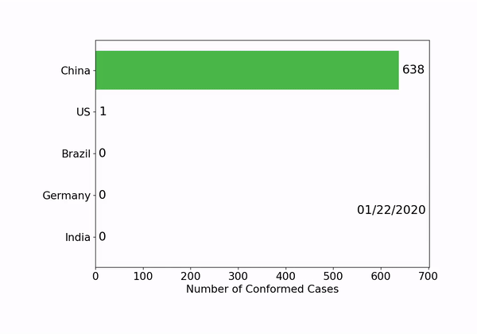
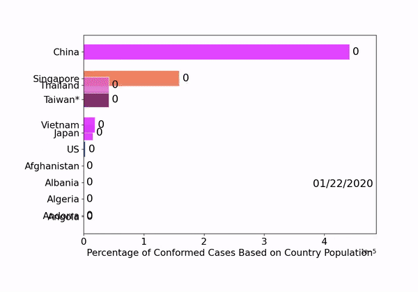
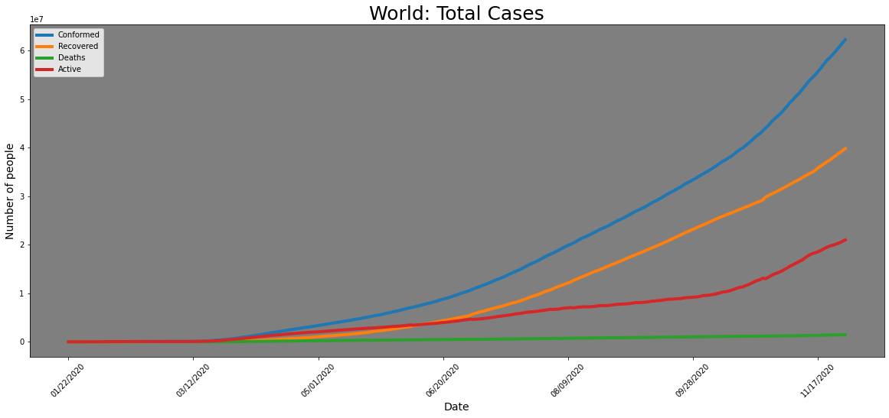
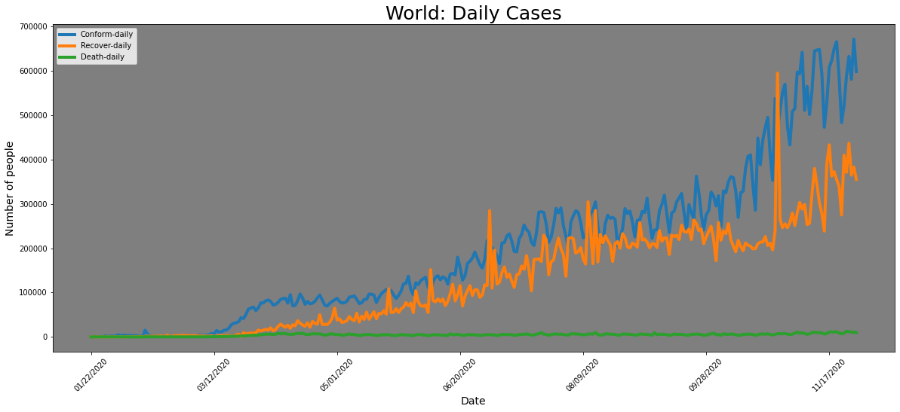

# Covid-19 Data Analaysis
## Covid-19 Data analyis using python.

This is the tutorial for basic analysis of COVID-19 data obtained from Johns Hopkins University covid data repository.

In this tutorial, we will go through following steps:

1)  We need data for analysis :). So we have to know from where we are getting our data. For this tutorial we are getting data from Johns Hopkins University covid data repository (source: https://github.com/CSSEGISandData/COVID-19).

2)  We will visualize the raw data.

3) We will clean the data and make nice table so that it will be easier active for us to analyze the data.

4) Since we have data only for conformed cases, death cases and recovery cases so using this we can calulate active cases and daily cases of Covid.

5) We will make various plots for analysis and visualization.

# COVID-19 data visualization

### Daily conformed cases of Covid-19 from January 2020. The visualization is for five selected country. You can change the country as per your need.

### Percentage of Conformed Cases Based on Country Population.

### Geographical distribution of  Covis-19 from January 2020.

### Total ases of COVID-19 from January 2020.

### Total Daily cases of COVID-19 from January 2020.

